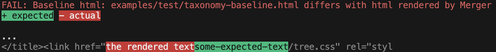

## merger-test, CLI for regression tests

This section describes the nodeJS command line interface that is used to regression test merger code. 
The same approach can be used for regression testing your own html that is rendered with merger.

It compares a baseline rendered html file, captured from a stable previous release, with html rendered with the current code of merger.
The baseline, and newly rendered html, normally use the same html template, mapping file, and mocked dataSource content.
However, to test new features, or for other reasons, the files and content can be edited to provide a new 'expected' baseline.

If the test of baseline html compares to the current render, the console indicates a match, e.g.

    PASS: Baseline html: examples/test/product-list-baseline.html equals html rendered by Merger

If there are differences, the console highlights each difference section with the expected render section, e.g.


### Invocation
```text
npx merger-test -h    
Usage: /usr/local/bin/node [options] <mappingJsonPath> <baselineHtmlPath> <dataSourcesPath>

Regression test: Compares merger rendered HTML, with a previously rendered baseline HTML

Arguments:
  mappingJsonPath                                   Path to merger mapping [.merger] file, controlling rendering.
  baselineHtmlPath                                  Path to the baseline html file. From a previous tested OK render.
  dataSourcesPath                                   Path to the dataSources object which defines all data sources used to render content

Options:
  -V, --version                                     output the version number
  -d,--debug                                        output extra debugging (default: false)
  -a,--chars-around-diff <charsAroundDiff>          The number of characters around the diff (default: 20)
  -c,--custom-functions-path <customFunctionsPath>  Path to custom functions to import (default: null)
  -h, --help                                        display help for command

```

Example:
```text
npx merger-test examples/taxonomy/tx-merger-map.merger examples/test/taxonomy-baseline.html 
../../../examples/taxonomy/content/data-sources.js --chars-around-diff=20 
-c ../../../examples/lib/custom-functions.js
```

<!--stackedit_data:
eyJoaXN0b3J5IjpbLTU0NjU3NTkxNiwtMjEwODI5NjYwNSwxMD
QyNTg5OTg1XX0=
-->