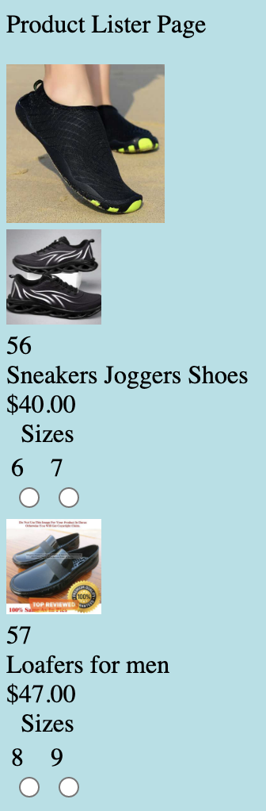

# Tutorials

This section decribes some examples of using Merger, within the Browser, to compose the dynamic view.
The examples would use Merger the same as they would in Node JS, but it is easier to try out and use Merger 
in a Browser, as there is no stack needed; and Browsers have good debug tools built in. 

The mapping json, that maps the source data to the html, would be exactly the same, irrespective of use in a Browser or Node JS.

## Example 1 Simple Product Lister

This example is for a simple list of products, using some mock json source data for shoes. 
Each product having a sub list of shoe sizes. As a prior step it is assumed that a html developer 
has created the static html and embedded the content to prototype what the page would look like for two products.

This is how that prototype page would display:

 Product List - Static Prototype</img>


The task of this example, is to use Merger, to dynamically render the page, using some mock json source 
data for a list of shoes.

### Ex1 Step1: Creating the html Template

In this step the example static content is removed and the repeated sections of the prototype page 
are collapsed to form single hidden 'section templates' of the html required for instances of the section.

> It is possible to go straight to the step of building an html template, without a prototype page 
with example static content. However, it is easier to illustrate what Merger requires of a template, 
by having the static prototype and turning that into a template.

The following shows the prototype html body, with embedded content:

```html
<body>
   <p id="products-header">Product Lister Page</p>
   
   <div class="products">
      <div class="product" id="product_56">
         <a href="">
            
         </a><br>
         <span class='product-id'>56</span><br>
         <span class='product-title'>Sneakers Joggers Shoes</span><br>
         <span class='price'>$40.00</span><br>
         <form class="attribute-sizes" name="sizes">
            <table>
               <caption class='size-label'>Sizes</caption>
               <tr>
                  <td class="attribute-size">
                     <label>6<br>
                        <input type="radio" name="size-6" value="6"><br>
                     </label>
                  </td>
                  <td class="attribute-size">
                     <label>7<br>
                        <input type="radio" name="size-7" value="7"><br>
                     </label>
                  </td>
               </tr>
            </table>
         </form>
      </div>
      <div class="product" id="product_57">
         <a href="">
            
         </a><br>
         <span class='product-id'>57</span><br>
         <span class='product-title'>Loafers for men</span><br>
         <span class='price'>$47.00</span><br>
         <form class="attribute-sizes" name="sizes">
            <table>
               <caption class='size-label'>Sizes</caption>
               <tr>
                  <td class="attribute-size">
                     <label>8<br>
                        <input type="radio" name="size-8" value="8"><br>
                     </label>
                  </td>
                  <td class="attribute-size">
                     <label>9<br>
                        <input type="radio" name="size-9" value="9"><br>
                     </label>
                  </td>
               </tr>
            </table>
         </form>
      </div>
   </div>
</body>

```
Removing the static prototype content, and collapsing the repeated product and size html into section templates, 
to create the required Merger template, gives:

```html
<body>
   <p id="products-header"></p>
   
   <div class="products">
      <div class="product template" id="product-template-1">
         <a href="">
            
         </a><br>
         <span class='product-id'></span><br>
         <span class='product-title'></span><br>
         <span class='price'></span><br>
         <form class="attribute-sizes" name="sizes">
            <table>
               <caption class='size-label'></caption>
               <tr>
                  <td class="attribute-size template">
                     <label><br>
                        <input type="radio" name="size-" value=""><br>
                     </label>
                  </td>
               </tr>
            </table>
         </form>
      </div>
   </div>
</body>
```
> Points to note:
>- Example static content, that will be provided dynamically from source data is removed. This isn't always necessary, 
as Merger will replace it at runtime. However, it simplifies the template, makes it pure mark up, and helps to avoid 
 errors at runtime leaving the example content in place, potentially on show.
>- The div with class of 'products' marks the start and end of the list of products
>- Its child div, with class of 'product template' is the mark up for a single product in the list, with no content
>- At runtime the dynamically created 'product' sections, will be inserted before the 'product template' at the same level 
>- The example products, of the prototype html, are removed
>- Section templates, such as 'product template' always have a secondary class of template. 
The CSS will always need a rule to hide sections with a class of template, e.g.

>>```css
.template {display: none;}
```
>
>- The product sizes need to appear within their parent product section, and as they are a list of dynamic length, 
they also have a section template with a class of 'attribute-size template'
>>- In this case the template is tagged with a 'td' element, which shows that the template section does not have to be a 'div'
>>- It also illustrates that changes to html can often be made, without changing merger configuration
>>- The input element has a name attribute with content of "size-". This is used by merger as a prefix for that size name, 
e.g. name="size-**7**"

### Ex1 Step2 Set up Dynamic Source Data

In practice the product source data would normally be a json service response. 
Merger requires the source data to be json objects, so the service response would be evaluated to to the appropriate object graph.
For this example though, the object graph is just a const within a script, containing some mock data to test with.

The mock data is an array of 5 products, in this case shoes, and each one has a collection of available sizes.
There is also an object, 'globalContent', listing some name value pairs, which are the pageTitle, pageImg, and sizeLabel.

The following is a snippet of the file, product-list-shoes.js, which details the globalContent and teo of the products:

```js
export const globalContent = {
   "pageTitle":"Product Lister",
   "pageImg":"https://dummyjson.com/image/i/products/57/1.jpg",
   "sizeLabel":"Sizes",
};

export const prods = {
   "products": [
      {
         "id": 56,
         "title": "Sneakers Joggers Shoes",
         "description": "Gender: Men , Colours: Same as DisplayedCondition: 100% Brand New",
         "price": 40,
         "discountPercentage": 12.57,
         "rating": 4.38,
         "stock": 6,
         "brand": "Sneakers",
         "category": "mens-shoes",
         "thumbnail": "https://dummyjson.com/image/i/products/56/thumbnail.jpg",
         "images": [
            "https://dummyjson.com/image/i/products/56/1.jpg", "https://dummyjson.com/image/i/products/56/2.jpg", "https://dummyjson.com/image/i/products/56/3.jpg", "https://dummyjson.com/image/i/products/56/4.jpg", "https://dummyjson.com/image/i/products/56/5.jpg", "https://dummyjson.com/image/i/products/56/thumbnail.jpg"
         ],
         "sizes": [
            6, 7, 8
         ]
      },
      {
         "id": 57,
         "title": "Loafers for men",
         "description": "Men Shoes - Loafers for men - Rubber Shoes - Nylon Shoes - Shoes for men - Pure Nylon (Rubber) Export Quality.",
         "price": 47,
         "discountPercentage": 10.91,
         "rating": 4.91,
         "stock": 20,
         "brand": "Rubber",
         "category": "mens-shoes",
         "thumbnail": "https://dummyjson.com/image/i/products/57/thumbnail.jpg",
         "images": [
            "https://dummyjson.com/image/i/products/57/1.jpg", "https://dummyjson.com/image/i/products/57/2.jpg", "https://dummyjson.com/image/i/products/57/3.jpg", "https://dummyjson.com/image/i/products/57/4.jpg", "https://dummyjson.com/image/i/products/57/thumbnail.jpg"
         ],
         "sizes": [
            6, 7, 8, 9
         ]
      },
```

Merger is configurable to use any types, names and quantity of data objects, so it uses **jpath** to link to the required
objects. Each separate source object needs to be registered. To do this there is a standard object name dataSources, and that is 
set up for this example as follows:

```js
import {prods} from "./product-list-shoes.js"
import {globalContent} from "./product-list-shoes.js"

export const dataSources = {};

dataSources.globals = globalContent;
dataSources.productList = prods.products;

// min and max index of source Products to show
dataSources.minProducts = 2;
dataSources.maxProducts = 3;
```

How the merger configuration mapping, uses **jpath** to obtain the source objects, will become apparent in the following section on configuration 
for this example.

> The minProducts, and maxProducts will be used in this example to show how merger can be configured to pick a start and end index
in a collection of objects. The mock data has 5 products, and we are setting to start rendering on the second and end on the third.

### Ex1 Step 3: Configuring (Mapping) of Source Data to html

This step illustrates a major benefit of merger. Using data configuration (mapping), to render the html, rather than writing code.

There are three levels of html that need to be mapped.

1. Top (Document Level) this is just mapping elements and their attributes, before any instantion of section templates.

2. The Product Template, to map the collection of source product objects for replication, filling, and insertion of product templates

3. Within the Product Template, the Size Template, requires mapping to the size data, for replication, filling, and insertion of the sizes 
for each product

> The mapping for Example 1, is contained in the ex1/merger-map.js file. 
The mapping object could of course be streamed from a service and evaluated, 
but for the purpose of the example it is already a named const.

The first step, the top level, is the simplest; as it just involves mapping source data to elements and attribute values.
The following snippet shows this part of the mapping:

```json
export const mergerMap = {
   "elementFills": [
      {
         "dataSrcJpath": "globals",
         "elementsToDo" : [
            {
               "elementTgtCss": "#products-header",
               "elementValueSrcJpath": "pageTitle"
            },
            {
               "elementTgtCss": "title",
               "elementValueSrcJpath": "pageTitle"
            },
            {
               "elementTgtCss": ".size-label",
               "elementValueSrcJpath": "sizeLabel"
            }
         ]
      },
      {
         "dataSrcJpath": "productList",
         "elementsToDo" : [
            {
               "elementTgtCss": "#products-header-img",
               "itsAttributes": [
                  {
                     "tgtAttrName": "src",
                     "srcJpath": "$..thumbnail"
                  },
                  {
                     "tgtAttrName": "alt",
                     "srcJpath": "$..thumbnail"
                  }
               ]
            }
         ]
      }
   ],
```

>- elementFills is an object containing an array of objects, each object contains element to source mappings for a single data source
>>- in the example, there are two of these objects, for data sources globals, and productList
>>- the dataSrcJpath value is the json path to the required data source within dataSources, i.e dataSources.globals, 
and dataSources.productList

>- for each data source, the elementsToDo array, contains objects that each map one element to a data source content value
>>- the elementTgtCss value is the CSS to select the target element
>>- the elementValueSrcJpath is the json path to select the content value of that element, the json path is relative to the data source
>>- so #products-header selects the element with id="products-header for filling with the source value 
"Product Lister" from globalContent.pageTitle

>- with dataSource productList the CSS #products-header-img selects the img tag with id="products-header-img"
>>- there is no json path in the map for source content for the img tag but the itsAttributes object is there
to define mappings for the img elements attributes
>>- similar to the element content mappings there are attribute name - content mappings
>>- the srcJpath json of "$..thumbnail" selects all values of data member "thumbnail", however the merger code 
will only use the first one, as it targets a a single element and its attributes
>>- so img attributes, src and alt, are filled with the content of the first thumbnail in the productList


 