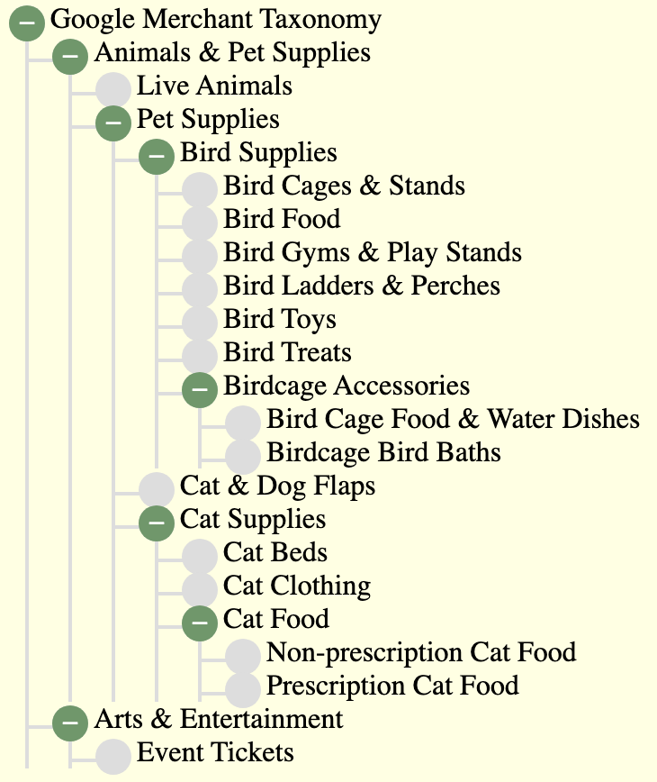
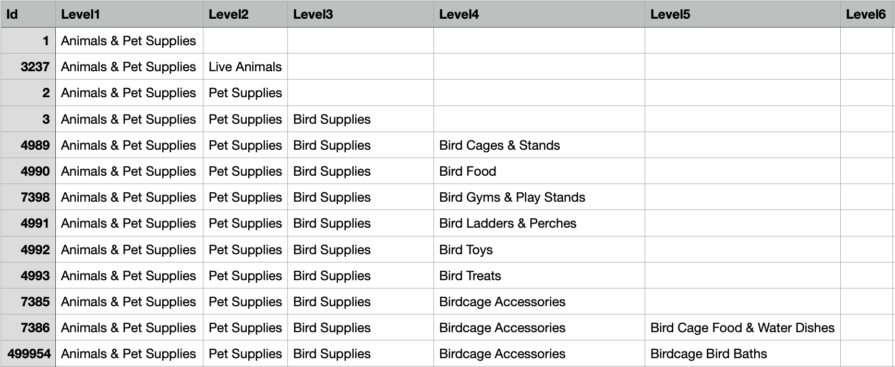

## Example 2 Taxonomy Tree

It is recommended to explore example 1 first, as the documentation for this example does not detail some  principles already covered in example 1.

This example renders a hierarchy of product categories, using some source data derived from the 
openly available Google Merchandising Taxonomy. The purpose of this example, is to show how merger can handle a deep hierarchy, both 
in the html, and the source data structure. The example taxonomy is of varying depth, up to six levels deep, with a large dynamic width.

This is how the example displays, with all tree branches in an open state:



[Open Taxonomy example to run in your Browser](examples/taxonomy/taxonomy-template.html)

For Node.js with Express server:
- [View example Node.js express index file](examples/express/index.js)
- [Folder with files referenced by example](https://github.com/JeffCoster/merger/tree/main/examples/taxonomy)
- [Custom Functions used in examples](examples/lib/custom-functions.js)

The Following notes describe how the example was created.

### Ex2 Step1: Creating the html Template

For this example, a readily available open source html tree was obtained from [I am Kate](https://iamkate.com/code/tree-views/).
This is a good example of a pure html and CSS tree. It has embedded static content for two levels of tree.

In this step of the example:

>- the example static content was removed from the html
>- the html branch sections of the prototype page, going down the page, were cropped to leave one top level branch
>- this was turned into a section template by giving it a top level class of "level1 template"
>- similar section templates were added, as children, up to six levels deep, with the "level1" class number being incremented for each level, e.g. "level2"
>>- the six levels, being enough to deal with the maximum depth of hierarchy 
>- the CSS was left unchanged
>- note that the static example, before any changes, had a slightly different html for the last node of the tree
>>- to deal with this, in merger, a custom function was developed which recognises when the last node in a branch has beed reached and modifies the html to be a last branch node
>>- this is explained in more detail in the custom function section of this example


The following snippet, shows the html template after this task; limited to three levels for brevity. 
```HTML
<body>
   <ul class="tree">
      <li>
         <details open>
            <summary id="tree-header"></summary>
            <ul>
               <li class="level1 template">
                  <details>
                     <summary></summary>
                     <ul>
                        <li class="level2 template">
                           <details>
                              <summary></summary>
                              <ul>
                                 <li class="level3 template">
                                    <details>
                                       <summary></summary>
                                       <ul>
                                          ...
                                       </ul>
                                    </details>
                                 </li>
                              </ul>
                           </details>
                        </li>
                     </ul>
                  </details>
               </li>
            </ul>
         </details>
      </li>
   </ul>
</body>
```
> Points to note:
>- Each unique top level category, level 1,  forms a branch of the tree, where the level1 template and its children are replicated
>- the next level, level 2 children of that level 1, form a child leaf node of level 1, which is the level 2 template
>- and so on, for level 3 and on, until there are no more child leaf nodes in the branch
>- at that point, i.e. when the dynamic source data has no more children for the branch, the custom function will form the last leaf node
>- merger will then start processing the next branch, with the next unique top level 1 category (node)

The full html template, can be downloaded as <a href='examples/taxonomy/taxonomy-template.html' target='_blank' download='taxonomy-template.html' type='text/plain'>taxonomy-template-node.html</a> This file includes the required CSS, and is the full file required for Node.js use.  

### Ex2 Step2 Set up Dynamic Source Data

In practice, the taxonomy tree dynamic data would normally be a JSON service response.
 
Merger requires the source data to be JSON objects, so the service response would be evaluated to the appropriate object graph. For this example though, as in Ex 1, the object graph is just a const within a script, containing some mock data to test with.

The taxonomy data was first obtained as a csv from Google using the .xls  download link on  [Google Merchant Taxonomy](https://support.google.com/merchants/answer/6324436?hl=en-GB)

This example, only needed a few rows of that data, so only those were used.

The following is an example snippet of the resulting rows:

 </img>

>- the id column contains the unique id of the lowest level category of the row
>- the other columns are for each level of category, in descending order

This data was converted to JSON using an  online utility. That left a flat representation, where each row of the CSV 
forms an object, with the other columns fields of the same row as data members; for example:

```js
{
      "id": 1,
      "level1": "Animals & Pet Supplies"
},
{
      "id": 3237,
      "level1": "Animals & Pet Supplies",
      "level2": "Live Animals"
},
{
      "id": 2,
      "level1": "Animals & Pet Supplies",
      "level2": "Pet Supplies"
},
{
      "id": 3,
      "level1": "Animals & Pet Supplies",
      "level2": "Pet Supplies",
      "level3": "Bird Supplies"
}

```
Merger requires the source data to be in hierarchical form, rather than this flat representation. For the purposes of this example 
a section of the hierarchy was manually transposed to be hierarchical. On a real project, there would be two options:

1) arrange for the service to return the JSON results in hierarchical format

2) use browser or Node.js code to transpose the results, prior to merger being invoked.

The following snippet shows the hierarchical form of the source data, as required by merger for this example: 

```js
export const taxonomy = [
   {
      "id": 1,
      "level1": "Animals & Pet Supplies",
      "sub2s": [
         {
            "id": 3237,
            "level2": "Live Animals"
         },
         {
            "id": 2,
            "level2": "Pet Supplies",
            "sub3s": [
               {
                  "id": 3,
                  "level3": "Bird Supplies",
                  "sub4s": [
                     {
                        "id": 4989,
                        "level4": "Bird Cages & Stands"
                     },
                     {
                        "id": 4990,
                        "level4": "Bird Food"
                     },
                     {
                        "id": 7398,
                        "level4": "Bird Gyms & Play Stands"
                     },
                     {
                        "id": 4991,
                        "level4": "Bird Ladders & Perches"
                     },
                     {
                        "id": 4992,
                        "level4": "Bird Toys"
                     },
                     {
                        "id": 4993,
                        "level4": "Bird Treats"
                     },
                     {
                        "id": 7385,
                        "level4": "Birdcage Accessories",
                        "sub5s": [
                           {
                              "id": 7386,
                              "level5": "Bird Cage Food & Water Dishes"
                           },
                           {
                              "id": 499954,
                              "level5": "Birdcage Bird Baths"
                           }
                        ]
                     }
                  ]
               },
               {
                  "id": 4497,
                  "level3": "Cat & Dog Flaps"
               },
               {
                  "id": 4,
                  "level3": "Cat Supplies",
                
                //...etc
```

The full source data for this example resides in [examples/taxonomy/googleTaxonomy.js. That file also has some global content, 
for title and header, which work in the same way as example 1. 

Data source registration is also composed in the same way as example 1, i.e.

```js
import {taxonomy} from "./googleTaxonomy.js"
import {globalContent} from "./googleTaxonomy.js"

export const dataSources = {};

dataSources.globals = globalContent;
dataSources.taxonomy = taxonomy;
```


### Ex2 Step 3: Configuring (Mapping) of Source Data to html

This step maps the Google taxonomy content, of step 2 to the html template of step 1.

The first step, the top (Document Level) is just mapping elements and their attributes, before any instantiation of section templates.
So it just maps some global content for page title, and the header label for the tree.

The mapping, for Example 2, is contained in the [merger-map.js](examples/taxonomy/merger-map.js) file as an object graph ready for browser import. 

For Node.js, the same mapping is in a [JSON file with .merger file extension](examples/taxonomy/tx-merger-map.merger), as merger will stream in and parse the file. In this case though, the mapping also declares the relative path to the html template, which will be streamed in by express using merger as a template engine.

The Snippet for the first mapping step is:
```js
export const mergerMap = {
   "elementFills": [
      {
         "dataSrcJpath": "globals",
         "elementsToDo": [
            {
               "elementTgtCss": "title",
               "elementValueSrcJpath": "pageTitle"
            },
            {
               "elementTgtCss": "#tree-header",
               "elementValueSrcJpath": "treeHeader"
            }
         ]
      }
   ],
```

> This one to one top level mapping is similar to Ex 1. So look at that for more detail.

The second step in the mapping task, follows on from the first object, and maps the taxonomy level section templates to their source object arrays. 

This is shown in the following snippet:

```js
"collections": [
      {
         "dataSrcJpath": "taxonomy",
         "templateId": "",
         "templateClassList": "level1 template",
         "srcIdPath": "id",
         "instanceFill": {
            "elementFills": [
               {
                  "dataSrcJpath": "instance",
                  "elementsToDo": [
                     {
                        "elementTgtCss": "summary",
                        "elementValueSrcJpath": "level1"
                     }
                  ]
               }
            ],
            "collections": [
               {
                  "dataSrcJpath": "sub2s",
                  "templateId": "",
                  "templateClassList": "level2 template",
                  "srcIdPath": "id",
                  "mtCollectionFunctSel": "lastLeafNode",
                  "instanceFill": {
                     "elementFills": [
                        {
                           "dataSrcJpath": "instance",
                           "elementsToDo": [
                              {
                                 "elementTgtCss": "summary",
                                 "elementValueSrcJpath": "level2"
                              }
                           ]
                        }
                     ],
                     "collections": [
                        {
                           "dataSrcJpath": "sub3s",


```

>- the snippet just shows the mapping for the top 2 levels, and a small part of the level 3
>>- in the full mapping, the maximum of 6 levels are mapped

>- collections within the instanceFill of a collection, are how merger maps the hierarchy of section templates to source object arrays
>>- in example 1 this approach was used to map products in a list, and to list sizes for each of those products
>>- in this example, it is used to map the taxonomy tree, e.g level 1 to child level 2s to child level 3s etc

The main aspects of the html section, to tree node source mapping, are described in the following table:

| collections[0] | (top) level 1 mapping|
|:-------------|:--|
| .dataSrcJpath = taxonomy | jsonPath to the source data taxonomy tree root  |
| .templateClassList = level1 template | class list of the level 1 html section template |
| .srcIdPath = id | id is jpath to taxonomy root[instance].id, for use as the unique (level 1) node Id

| collections[0].instanceFill.elementFills[0] | element fills required for level 1 nodes|
| :------- | :--- |
| .elementsToDo[0].elementTgtCss = summary | template relative CSS, to find summary target element for showing node name |
| .elementsToDo[0].elementValueSrcJpath = level1 | jpath to instance.level1, for use as the node name |

| collections[0].instanceFill.collections[0] |level 2 mapping |
| :------- | :--- |
| .dataSrcJpath = sub2s | jsonPath, relative to parent (level 1) node, to the child array of level 2 nodes  |
| .templateClassList = level2 template | class list of the level 2 html section template |
| .srcIdPath = id | id is jpath to level 2 id, for use as the unique (level 2) node Id |
| .mtCollectionFunctSel = lastLeafNode| registered name of custom function to invoke if the source array is empty, in this example meaning last leaf node of branch was reached

| collections[0].instanceFill.collections[0].instanceFill.elementFills[0] | element fills required for level 2 nodes|
| :------- | :--- |
| .elementsToDo[0].elementTgtCss = summary | template relative CSS, to find summary target element for showing node name |
| .elementsToDo[0].elementValueSrcJpath = level2 | jpath to instance.level2, for use as the level 2 node name |

| collections[0].instanceFill.collections[0].instanceFill.collections0 |level 3 mapping |
| :------- | :--- |
| ... pattern continues for level 3 and subsequent levels | ... |


In Operation:

>- to start with, merger will pick the top level array of the taxonomy tree source content, as indicated by the dataSrcJpath of "taxonomy"
>- the first element of that array will be processed, and the "level 1" content, i.e. "Animals & Pet Supplies" will fill the "summary" element
>- for that "instanceFill", merger will then find the child data source array "sub2s" and the "level 2" content "Live Animals" will 
fill the "summary" of the first level 2 instance
>- the level 2 node "Live Animals" in the data source has no children, so when merger looks for a sub3s array it finds none, so:
>>- the 'empty collection' custom function is invoked, as declared by the 'mtCollectionFunctionSel' = 'lastLeafNode'
>>- this custom function, adapts the html, so that the last node in a branch, will appear as it should, with no plus or minus symbol
>- processing of the branch ends, and continues with the next level 1 branch
> 
> note that the mapping for level 2 and lower levels, each specify the same "mtCollectionFunctionSel", this is because the last branch node could be at any level below level 1


<!--stackedit_data:
eyJoaXN0b3J5IjpbLTEzMDg0MTg1MjksNjAxODk0NTU1LC05ND
U4OTk2MzRdfQ==
-->