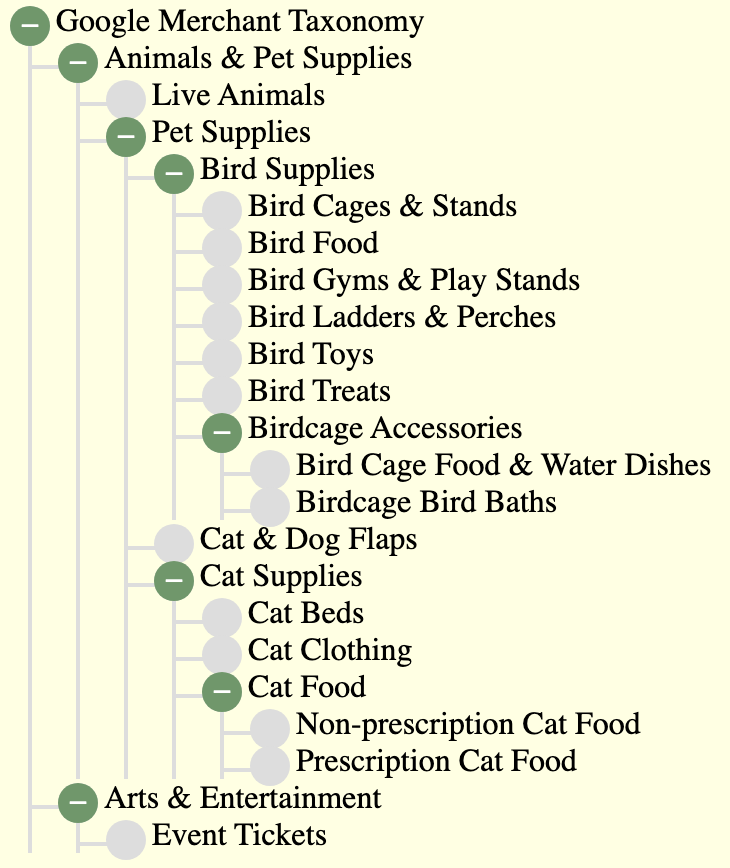
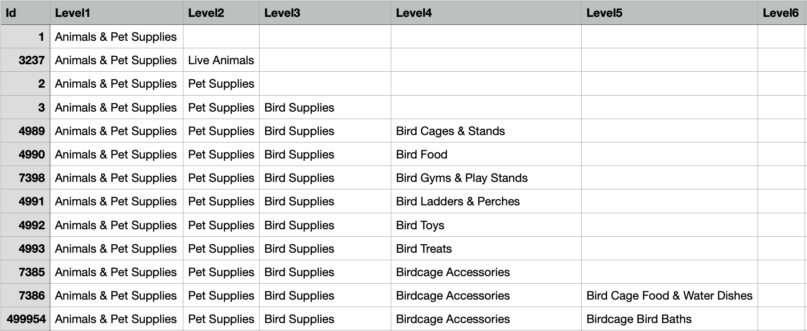

## Example 2 Taxonomy Tree

It is recommended to explore example 1 first, as the documentation for that is more complete. 
This example does not detail some of the priciples already covered in example 1.

This example renders a hierachy of product categories, using some source data derived from the 
openly availaible Google Merchandising Taxonomy. The purpose of this example, is to show how merger can handle a deep hierachy, 
in the html, and the source data structure. The example taxonomy is of varying depth, up to six levels deep, and also covers a large dynamic width .

This is how the example displays, with all tree branches in an open state:

 Part of Google Merchandising Taxonomy </img>

### Ex2 Step1: Creating the html Template

For this example a readily available open source html tree example was obtained from [I am Kate](https://iamkate.com/code/tree-views/).
This is a good example of a pure html and CSS tree, and as available from that site, it has static content for two levels of tree.

In this step of the example:

>- the example static content was removed from the html
>- the html branch sections of the prototype page, going down the page, were cropped to leave one top level branch
>- this was turned into a section template by giving it a top level class of "level1 template"
>- similar section templates were added as children up to six levels deep, with the "level1" class number being incremented for each level, e.g. "level2"
>>- the six levels, being enough to deal with the maximum depth of hierarchy 
>- the CSS was left unchanged
>- note that the static example, before any changes, had a slightly different html for the last node of the tree
>>- to deal with this in merger, required a custom function to recognise that the last node had been reached and modify the html accordingly
>>- this is explained in more detail in the custom function section of this example


The following snippet, shows the html template after this task; limited to three levels for brevity. 
The full html resides in the file ex2/content/taxonomy.html, which also includs the CSS, 
and the boiler plate javascript for merger.

```html
<body>
   <ul class="tree">
      <li>
         <details open>
            <summary id="tree-header"></summary>
            <ul>
               <li class="level1 template">
                  <details>
                     <summary></summary>
                     <ul>
                        <li class="level2 template">
                           <details>
                              <summary></summary>
                              <ul>
                                 <li class="level3 template">
                                    <details>
                                       <summary></summary>
                                       <ul>
                                          ...
                                       </ul>
                                    </details>
                                 </li>
                              </ul>
                           </details>
                        </li>
                     </ul>
                  </details>
               </li>
            </ul>
         </details>
      </li>
   </ul>
</body>
```
> Points to note:
>- Each unique top level category, level 1,  forms a branch of the tree, where the level1 template and its children are replicated
>- the next level, level 2 children of that level 1, form a child leaf node of level 1, which is the level 2 template
>- and so on, for level 3 and on, until there are no more child leaf nodes for the branch
>- at that point, when the dynamic source data has no more children for the branch, the custom function will form the last leaf node
>- merger will then start processing the next branch, with the next unique top level 1 category (node)

### Ex2 Step2 Set up Dynamic Source Data

In practice the taxonomy tree dynamic data would normally be a json service response. 
Merger requires the source data to be json objects, so the service response would be evaluated to to the appropriate object graph.
For this example though, as in Ex 1, the object graph is just a const within a script, containing some mock data to test with.

The taxonomy data was first obtained as a csv from Google using the links on this page [merchant taxonomy](https://support.google.com/merchants/answer/6324436?hl=en-GB)

This example, only needed a few branches of that data so a few were retained and the rest discarded.

The following is an example snippet of a few rows:

 </img>

>- the id column contains the unique id of the lowest level category of the row
>- the rest is self explanatory

This data was converted to json using an  online utility. That left a "flat" representation, where each row of the csv 
forms an object with the other columns fields of the same row as data members, for example:

```json
{
      "id": 1,
      "level1": "Animals & Pet Supplies"
},
{
      "id": 3237,
      "level1": "Animals & Pet Supplies",
      "level2": "Live Animals"
},
{
      "id": 2,
      "level1": "Animals & Pet Supplies",
      "level2": "Pet Supplies"
},
{
      "id": 3,
      "level1": "Animals & Pet Supplies",
      "level2": "Pet Supplies",
      "level3": "Bird Supplies"
}

```
Merger requires the source data to be in hierachical form, rather than this flat representation. For the purposes of this example 
a section of the hierarchy was manually transposed to be hierarhical. On a real project, there would be two options:

1) arrange for the service to return the json results in hierarchical format

2) use browser or node JS code to transpose the results, prior to merger being invoked

The following snippet shows the hierachical form of the source data, as required by merger and this example: 

```js
export const taxonomy = [
   {
      "id": 1,
      "level1": "Animals & Pet Supplies",
      "sub2s": [
         {
            "id": 3237,
            "level2": "Live Animals"
         },
         {
            "id": 2,
            "level2": "Pet Supplies",
            "sub3s": [
               {
                  "id": 3,
                  "level3": "Bird Supplies",
                  "sub4s": [
                     {
                        "id": 4989,
                        "level4": "Bird Cages & Stands"
                     },
                     {
                        "id": 4990,
                        "level4": "Bird Food"
                     },
                     {
                        "id": 7398,
                        "level4": "Bird Gyms & Play Stands"
                     },
                     {
                        "id": 4991,
                        "level4": "Bird Ladders & Perches"
                     },
                     {
                        "id": 4992,
                        "level4": "Bird Toys"
                     },
                     {
                        "id": 4993,
                        "level4": "Bird Treats"
                     },
                     {
                        "id": 7385,
                        "level4": "Birdcage Accessories",
                        "sub5s": [
                           {
                              "id": 7386,
                              "level5": "Bird Cage Food & Water Dishes"
                           },
                           {
                              "id": 499954,
                              "level5": "Birdcage Bird Baths"
                           }
                        ]
                     }
                  ]
               },
               {
                  "id": 4497,
                  "level3": "Cat & Dog Flaps"
               },
               {
                  "id": 4,
                  "level3": "Cat Supplies",
```

> The full source data for this example resides in ex2/googleTaxonomy.js. That file, also some global content, 
for title and header, which work in the same way as example 1, as does the way the data sourcees are registered. 

Merger is configurable to use any types, names and quantity of data objects, so it uses **jpath** to link to the required
objects. Each separate source object needs to be registered. To do this there is a standard object name dataSources, and that is 
set up for this example as follows:

```js
import {prods} from "./product-list-shoes.js"
import {globalContent} from "./product-list-shoes.js"

export const dataSources = {};

dataSources.globals = globalContent;
dataSources.productList = prods.products;

// min and max index of source Products to show
dataSources.minProducts = 2;
dataSources.maxProducts = 3;
```

How the merger configuration mapping, uses **jpath** to obtain the source objects, will become apparent in the following section on configuration 
for this example.

### Ex2 Step 3: Configuring (Mapping) of Source Data to html

This step illustrates a major benefit of merger. Using data configuration (mapping), to render the html, rather than writing code.

There are three levels of html that need to be mapped.

1. Top (Document Level) this is just mapping elements and their attributes, before any instantion of section templates.

2. The Product Template, to map the collection of source product objects for replication, filling, and insertion of product templates

3. Within the Product Template, the Size Template, requires mapping to the size data, for replication, filling, and insertion of the sizes 
for each product

> The mapping for Example 1, is contained in the ex1/merger-map.js file. 
The mapping object could of course be streamed from a service and evaluated, 
but for the purpose of the example it is already a named const.

The first step, the top level, is the simplest; as it just involves mapping source data to elements and attribute values.
The following snippet shows this part of the mapping:

```json
export const mergerMap = {
   "elementFills": [
      {
         "dataSrcJpath": "globals",
         "elementsToDo" : [
            {
               "elementTgtCss": "#products-header",
               "elementValueSrcJpath": "pageTitle"
            },
            {
               "elementTgtCss": "title",
               "elementValueSrcJpath": "pageTitle"
            },
            {
               "elementTgtCss": ".size-label",
               "elementValueSrcJpath": "sizeLabel"
            }
         ]
      },
      {
         "dataSrcJpath": "productList",
         "elementsToDo" : [
            {
               "elementTgtCss": "#products-header-img",
               "itsAttributes": [
                  {
                     "tgtAttrName": "src",
                     "srcJpath": "$..thumbnail"
                  },
                  {
                     "tgtAttrName": "alt",
                     "srcJpath": "$..thumbnail"
                  }
               ]
            }
         ]
      }
   ],
```

>- elementFills is an object containing an array of objects, each object contains element to source mappings for a single data source
>>- in the example, there are two of these objects, for data sources globals, and productList
>>- the dataSrcJpath value is the json path to the required data source within dataSources, i.e dataSources.globals, 
and dataSources.productList

>- for each data source, the elementsToDo array, contains objects that each map one element to a data source content value
>>- the elementTgtCss value is the CSS to select the target element
>>- the elementValueSrcJpath is the json path to select the content value of that element, the json path is relative to the data source
>>- so #products-header selects the element with id="products-header for filling with the source value 
"Product Lister" from globalContent.pageTitle

>- with dataSource productList the CSS #products-header-img selects the img tag with id="products-header-img"
>>- there is no json path in the map for source content for the img tag but the itsAttributes object is there
to define mappings for the img elements attributes
>>- similar to the element content mappings there are attribute name - content mappings
>>- the srcJpath json of "$..thumbnail" selects all values of data member "thumbnail", however the merger code 
will only use the first one, as it targets a a single element and its attributes
>>- so img attributes, src and alt, are filled with the content of the first thumbnail in the productList

The second step in the mapping task, mapping the product template html to its source objects, is shown in the following snippet:

```json
  "collections": [
      {
         "dataSrcJpath": "productList",
         "templateId": "product-template-1",
         "srcIdPath": "id",
         "startDataSrcJpath": "minProducts",
         "maxToShowDataSrcJpath": "maxProducts",
         "instanceFill": {
            "elementFills": [
               {
                  "dataSrcJpath": "instance",
                  "elementsToDo" : [
                     {
                        "elementTgtCss": ".product-title",
                        "elementValueSrcJpath": "title",
                        "functionSel": "escape"
                     },
                     {
                        "elementTgtCss": ".product-id",
                        "elementValueSrcJpath": "id"
                     },
                     {

                        "elementTgtCss": ".price",
                        "elementValueSrcJpath": "id",
                        "functionSel": "priceFormat"
                     },
                     {
                        "elementTgtCss": ".thumbnail",
                        "elementValueSrcJpath": "title",
                        "itsAttributes": [
                           {
                              "tgtAttrName": "src",
                              "srcJpath": "thumbnail"
                           },
                           {
                              "tgtAttrName": "alt",
                              "srcJpath": "thumbnail"
                           }
                        ]
                     }
                  ]
               }
            ],
```

>- collections is an object containing an array of objects, each object contains element to source mappings for a single data source
>>- in the example, there is one of these objects, for data source: productList, within this:
>>- the dataSrcJpath value is the json path to this data source within dataSources, i.e dataSources.productList
>>- the templateId identifies the id of the target product template element
>>- the minProducts and maxProducts are json paths to the variables containing start and end bounds for the displayed 
list of products, i.e. dataSources.minProducts, and dataSources.maxProducts 

>- for this collection, the instanceFill has an elementFills object to map elements of each instantiated template, to the 
corresponding object values. 
>>- so instance [n] of the template maps to source object [n] of its list, but it is only necessary to map one instance to one source object
>>- the functionSel "escape" is used to escape html special chars in the title
>>- the functionSel "priceFormat" is used to format the price, in this example it just prepends a $ 
>>- all other elementFills aspects have already been explained

>- the srcIdPath, for each collection, deserves explanation
>>- it is the jsonPath, relative to the source object, of the unique Id to use to help form a unique id in the target html page/partial
>>- so is this example, each product in the source list has an 'id' field, with values that are unique product identifiers
>>- the srcIdPath= 'id' instructs merger to use this when forming the product Ids
>>- at runtime the default behaviour, for forming the target html instance id is: use the first class declared for a template; 
in this case 'product', append an underscore, then end with the source object id
>>- so in this example, for a product with source id of 60 the snippet of target html of product instance would be:

```html
<div class="product" id="product_50">
   // ...
</div>
```
>- note: for child collections, e.g product sizes, the parent id prepends the ids of the children

The third and last step of this examples mapping task, maps source (product) sizes to html product instance sizes. 
The following json mapping snippet shows this:

```json
  "collections": [
      {
         "dataSrcJpath": "productList",
         "templateId": "product-template-1",
         "srcIdPath": "id",
         "startDataSrcJpath": "minProducts",
         "maxToShowDataSrcJpath": "maxProducts",
         "instanceFill": {
            "elementFills": [
               // already explained
            ],
            "collections": [
               {
                  "dataSrcJpath": "sizes",
                  "templateClassList": "attribute-size template",
                  "srcIdPath": "",
                  "instanceFill": {
                     "elementFills": [
                        {
                           "dataSrcJpath": "instance",
                           "elementsToDo" : [
                              {
                                 "elementTgtCss": "label",
                                 "elementValueSrcJpath": "",
                                 "functionSel": "prepend"
                              },
                              {
                                 "elementTgtCss": "input",
                                 "itsAttributes": [
                                    {
                                       "tgtAttrName": "input",
                                       "srcJpath": ""
                                    },
                                    {
                                       "tgtAttrName": "name",
                                       "srcJpath": "",
                                       "functionSel": "append"
                                    },
                                 ]
                              }
                           ]
                        }
                     ]
```

>- The sizes are a child template of the product, so the collection to map the sizes is a child of the collection that maps the products
>- the dataSrcJpath of "sizes" is relative to the parent instance, and maps to the sizes array
>- the srcIdPath is not declared, as there is no natural unique key for each size, so the merger code will use the actual value 
of the size instead, e.g. 7
>>- an example target ID for the sizes, once the parent ID is prepended, would be like this in the html:

```html
   <td class="attribute-size" id="product_60_attribute-size_10">
```

>- the elementsToDo[0] for element "label" has:
>>- an undeclared elementValueSrcJpath, which means that merger will use the whole of the source object instance as the content value, 
this approach is needed, as in this case the object in the sizes array is just a string, e.g. "7"
>>- a functionSel of "prepend" to ensure that the source content is prepended to the existing contents of the template, the sizes 
template being as follows, where the size needs to be added before the br tag

```html
<td class="attribute-size template">
   <label><br>
         <input type="radio" name="size-" value=""><br>
   </label>
</td>
```

>- the elementsToDo[1] for element "input" has:
>>- an undeclared srcJpath, for each attribute mapping, so again meaning use the whole source content, e.g."10"
>>- for attribute name: a functionSel of "append", meaning append the source content, to existing content of the name attribute, 
e.g. name="size-10"

So the end result of all collection mapping, results in the html for a product instance being like:

```html
<div class="product" id="product_59">
         <a href="">
            
         </a><br>
         <span class="product-id">59</span><br>
         <span class="product-title">Spring &amp; ' &lt; &gt; summer shoes</span><br>
         <span class="price">$59</span><br>
         <form class="attribute-sizes" name="sizes">
            <table>
               <caption class="size-label">Sizes</caption>
               <tbody>
                  <tr>
                     <td class="attribute-size" id="product_59_attribute-size_11">
                        <label>11<br>
                           <input type="radio" name="size-11" value="" input="11"><br>
                        </label>
                     </td><td class="attribute-size template">
                        <label><br>
                           <input type="radio" name="size-" value=""><br>
                        </label>
                     </td>
                  </tr>
               </tbody>
            </table>
         </form>
      </div>
```
