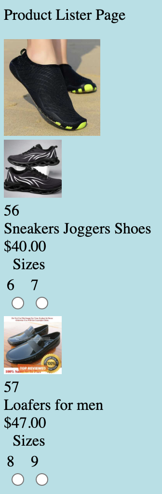

---
---













 
<a href="examples/product-list/product-lister-template.html" target="_blank">
    
    Open full example1 to run in Browser 
</a>



 
<a href="examples/taxonomy/taxonomy-template.html" target="_blank">
    
    Open full example2 to run in Browser 
</a>


