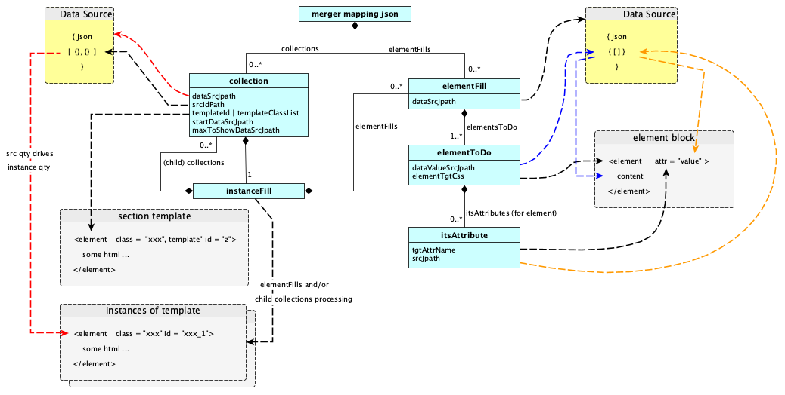

## Merger Mapping Schema

This section describes the JSON schema.

The configured mapping is what drives Merger operations. 

It maps:
* html template sections to the source object collections that drive instantiation and filling of the section templates
* html elements and attributes to the dynamic source data that fills their content.

> Note: The schema for merger mapping is contained in schema/merger-schema.js.

The following Object Model, depicts the main objects, data fields and object relationships, which are formally specified in the schema.

> Structually:

>> the top level mergerSchema object can have zero or more elementFills and zero or more collections

>> a collections object, has an instanceFill object, that can contain zero or more collections, and zero, or more elementFills.

>> The dashed flows show merger runtime operations, that read from the data sources, and update the html, according to the specified mapping.

### Schema Object Definitions

#### elementFills

| templatePath | |
| :------- | :--- |
| Object Description | String. **Required for Node.js rendering**. Path to the html template file on the node server. The path is relative to the JSON mapping file. Browser rendering already contains html template(s) in the DOM, so doesn't need this path, and if declared the browser rendering will ignore it. |

| elementFills[] | |
|:-------------|:--|
| Object Description | Optional Array of elementFill objects, each object uses one data source object graph, and maps its content values to the required target html elements, and attributes. |
| dataSrcJpath | Required, jsonPath expression, to find a registered data source, within dataSources |

| elementFill[].elementsToDo[] | |
| :------- | :--- |
| Object Description | Optional Array of objects, each object maps a html element value, to the source content that will fill it |
| elementTgtCss | Required, CSS expression to find a target element in the document or template instance html |
| elementValueSrcJpath | Required jsonPath expression, to find the content, within the elementFill data source, to use as the target element value
| functionSel | Optional, registered name of an extension function to use for additional processing, e.g. for formatting. See Merger Functions for more detail |

| elementFill.elementToDo.itsAttributes[] | |
| :------- | :--- |
| Object Description | Optional Array of objects, one object for each attribute of its parent element, which requires source content |
| tgtAttrName | Required, name of the attribute that needs filling for the parent element
| srcJpath | Required jsonPath expression, to find the content value, within the elementFill data source; to use as the attribute value
| functionSel | Optional, registered name, that selects a function to use for additional processing, e.g. for formatting. |

#### collections

| collections[] | |
|:-------------|:--|
| Object Description | Optional Array of collection objects, each collection maps to one data source object array, and to one target html section template. Each object in the source array drives the creation and filling of an instance of the section template.|
| dataSrcJpath | Required jsonPath expression to find the required data source array in dataSources. |
| templateId or   templateClassList | ID or class list used to find the target html section template. ID is normally for top level section templates, and class list for child templates. Must be unique within the collection scope |
| srcIdPath | Optional jsonPath to select the ID within each data source object, used to form the ID values of the target instances. |
| startDataSrcJpath | Optional jsonPath within Data Sources, declares a variable, used to indicate start index into the source object array. Zero being the first element. |
| maxToShowDataSrcJpath | Optional jsonPath within Data Sources, to a variable, used to indicate maximum quantity to show from source collection. A value of 3 means a maximum of 3 objects will be shown. |
| mtCollectionFunctSel | Optional registered name that selects the registered function to use for additional processing when the source data array is empty |

| collection.instanceFill | |
| :---- | :---- |
| Object Description | Required: zero or one (child) collections array, zero or one elementFills array. Note: collections can contain collections to handle the hierarchical nature of html. The elementFills array maps content from each source object to its corresponding instance of the section template.

> Important Note:  Within an instanceFill object:

>> All CSS expressions are scoped to the html section template, not the whole document

>> All jsonPath expressions, default in scope, to the source data object, which instantiated the instance of the template. This is the *normal* case, where the dataSourceJpath, within the instanceFill, is left empty, or is set to "instance".
This default behaviour, can be overridden, by specifying a dataSourceJpath -- of another data source.

<!--stackedit_data:
eyJoaXN0b3J5IjpbLTEyMDcxODg4ODhdfQ==
-->