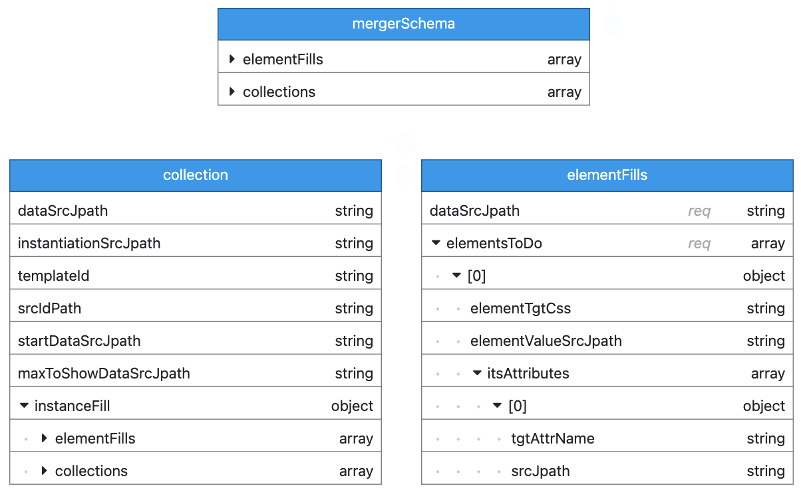

## Merger Mapping Schema

This section describes the json schema which controls the json merger mapping.

The mapping is at the heart of merger operation. It configures the html elements and attributes to their dynamic source data, 
and html template sections to the source object collections that drive instantions of the section templates.

> The schema for merger mapping is contained in schema/merger-schema.js and its child schemas: collections-schema.js, 
and element-fills-schema.js

The following schema diagram, produced using https://www.schemavisualizer.com/ shows the structure and main options for the mapping json data.

> Structually:

>> the top level mergerSchema can have 0 or more elementFills and zero or more collections

>> a collections object, has an instanceFill object that can contain zero or more collections and zero 
or more elementFills

### Object Definitions

#### elementFills

| elementFills[] | |
|:-------------|:--|
| Object Description | Array of elementFill objects, each uses one data source object graph, and maps its content values to the required target html elements, and attributes. |
| dataSrcJpath | jsonPath expression to find the required registered data source in dataSources |

| elementFill[].elementsToDo[] | |
| :------- | :--- |
| Object Description | Array of objects, one object for each html element that needs mapping to source content to fill it |
| elementTgtCss | CSS expression to find a target element in the document or template instance html |
| elementValueSrcJpath | jsonPath expression to find the content value, within the elementFill data source, to use as the element value
| functionSel | where an extra function is required, forcontent or target processing, e.g. formatting; this is the registered identifying name for the registered function |

| elementFill.elementToDo.itsAttributes[] | |
| :------- | :--- |
| Object Description | Array of objects, one object for each attribute of parent element that requires source content |
| tgtAttrName | name of the attribute that needs filling for the parent element
| srcJpath | jsonPath expression to find the content value, within the elementFill data source; to use as the attribute value
| functionSel | where an extra function is required, forcontent or target processing, e.g. formatting; this is the registered identifying name for the registered function |

#### collections

| collections[] | |
|:-------------|:--|
| Object Description | Array of collection objects, each use one data source object graph, and maps a collection within that, to a target html section template |
| dataSrcJpath | jsonPath expression to find the required registered data source in dataSources |
| templateId or   templateClassList |    ID or class list used to find the target html section template |
| srcIdPath | jsonPath to select the ID from the data source, used to form the html ID attribute values of target instances |
| startDataSrcJpath"| jsonPath within Data Sources, to variable used to indicate start index into source collection |
| maxToShowDataSrcJpath | jsonPath within Data Sources, to variable used to indicate max qty to show from source collection |
| mtCollectionFunctSel | registered name that selects the registered function to use for additional processing when source data collection is empty |

| collection.instanceFill | |
| :---- | :---- |
| Object Description | Contains: zero or one collections array, zero or one elementFills array. Note: collections can contain collections to handle the hierarchical nature of html.

> Important Note:  Within an instanceFill object:

>> All CSS expressions are scoped to the html section template, not the whole document

>> All jsonPath expressions, default in scope, to the source data object that instantiated that instance of the template.
This is the case where the dataSourceJpath, within the instanceFill is left empty on is set to "instance".
This default behaviour can be overriden by specifying a dataSourceJpath to the required data source.

